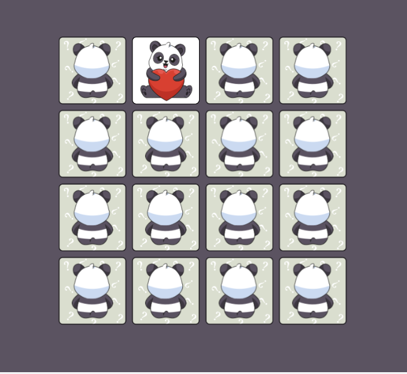

# Memory-game

[Demo](https://yasya23.github.io/memory-game/)

## Overview

This game is a browser-based card-matching game that presents the player with cards arranged in a 4x4 grid.

The back of each card is a common design shared by all cards. The front contains a distinctive symbol shared by one pair of cards in the deck, thus there are 8 unique symbols shared by 8 pairs of cards in the deck.

The objective of the Memory Game is for the player to turn over pairs of matching cards across eight successive turns. In a turn, if the player selects two cards whose symbols match those cards, along with those successfully matched in previous turns, they will disappear. However, if the player chooses two cards with different symbols they will both be flipped over, obscuring their symbols.

The game ends when all eight pairs of matching cards have been revealed. When this occurs a message should be displayed to let the user know they have won the game.

A 'New Game' Button gives the player the means to reset the game board.

### Built with

- HTML5
- CSS
- JS

### Screenshot

